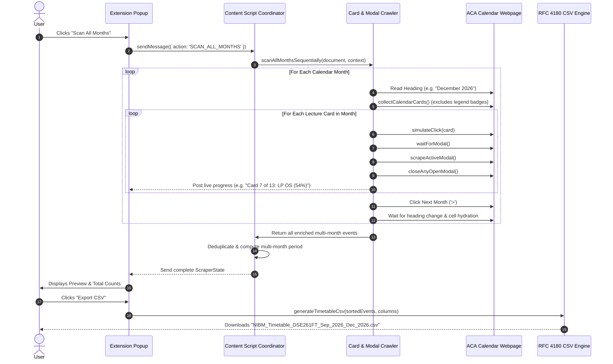

# 🎓 NIBM ACA Timetable Exporter (Chrome Extension - Manifest V3)

<p align="center">
  
</p>

<p align="center">
  <strong>A high-performance, privacy-first Google Chrome extension designed for students of the National Institute of Business Management (NIBM).</strong><br>
  Automatically crawl, enrich, and export entire semester lecture schedules from the official <strong>ACA Academic Calendar</strong> (<a href="https://aca.mynibm.com/">aca.mynibm.com</a>) into a beautifully organized, Excel-ready single CSV file.
</p>

<p align="center">
  <a href="https://developer.chrome.com/docs/extensions/mv3/"></a>
  <a href="https://www.typescriptlang.org/"></a>
  <a href="https://vitest.dev/"></a>
  <a href="https://esbuild.github.io/"></a>
  <a href="#strict-privacy--zero-knowledge-security-model"></a>
  <a href="LICENSE"></a>
</p>

---

## 📌 Table of Contents

- [Overview](#-overview)
- [Key Features](#-key-features)
- [How It Works (Under the Hood)](#-how-it-works-under-the-hood)
- [System Architecture & Flow Diagram](#-system-architecture--flow-diagram)
- [Technology Stack](#-technology-stack)
- [Supported Lecture & Event Types](#-supported-lecture--event-types)
- [Strict Privacy & Zero-Knowledge Security Model](#-strict-privacy--zero-knowledge-security-model)
- [Project Structure](#-project-structure)
- [Installation Guide](#-installation-guide)
- [Usage Guide](#-usage-guide)
- [CSV Format & Excel Compatibility](#-csv-format--excel-compatibility)
- [Verification & Automated Tests](#-verification--automated-tests)
- [Troubleshooting & FAQ](#-troubleshooting--faq)
- [License](#-license)

---

## 🚀 Overview

The **NIBM Academic Calendar (ACA)** web portal (`https://aca.mynibm.com/`) displays student timetables in interactive monthly grids. However, vital details—such as **lecturer names**, **lecture hall/room numbers**, **exact lecture hours**, and **learning mode (Physical vs Online)**—are hidden behind clickable card popups and modals.

Manually clicking through dozens of cards across several months to build a personal schedule is tedious and error-prone. 

The **NIBM ACA Timetable Exporter** completely solves this problem:
1. **Automated Headless Card Clicker**: Automatically iterates through all lecture cards, simulates native mouse interactions to trigger React detail modals, extracts rich details, and dismisses each modal safely.
2. **Multi-Month Automated Crawler**: Navigates through upcoming months sequentially (e.g. September ➔ October ➔ November ➔ December) with intelligent DOM settling timers.
3. **Unified Chronological Single CSV**: Normalizes, deduplicates, and sorts all events in chronological order (`YYYY-MM-DD` ascending, then `HH:mm` start time) and exports everything into a **single, unified RFC 4180 CSV file**.

---

## ✨ Key Features

- 📅 **Multi-Month Sequential Auto-Scan (`Scan All Months`)**: Crawls all consecutive calendar months with timetable data automatically and compiles them into one dataset.
- ⚡ **Automated Modal Enrichment Engine**: Opens each card's popup modal in sequence to capture lecturer, venue/hall, exact times, and mode without manual clicking.
- 🎯 **Dynamic Month & Year Heading Detection**: Accurately detects calendar changes (e.g. switching between months) and synchronizes dates without getting stuck on previous months.
- 🛡️ **Intelligent Legend Filtering**: Strictly distinguishes between real lecture cards on the calendar and bottom legend badges (e.g. `SM Seminar`, `WS Workshop`), avoiding false positives.
- 🔄 **Smart Deduplication & Multi-Slot Support**: Accurately preserves multiple lectures scheduled on the same date (e.g. morning lecture + afternoon lecture for the same subject).
- 📊 **Interactive Live Preview & Quick Search**: In-popup search by course code, subject name, lecturer, or hall with instant record count updates.
- 🔍 **Safe Filter Auto-Reset**: Prevents empty previews or failed exports if previous date filters hid current results.
- 📑 **Excel-Ready RFC 4180 CSV Export**: Prepends UTF-8 Byte Order Mark (`\uFEFF`), uses Windows CRLF (`\r\n`) line endings, escapes commas and quotes, and ensures flawless display in **Microsoft Excel**, **Google Sheets**, and **Apple Numbers**.
- 🎨 **Academic UI Theme**: Designed with NIBM's professional Navy Blue palette, live percentage progress indicators, and intuitive controls.
- 🔒 **100% Local & Privacy-First**: Zero external servers, zero API tokens read, zero tracking, zero telemetry.

---

## ⚙️ How It Works (Under the Hood)

Here is a step-by-step breakdown of how the scraper and enrichment engine operates:

```
+-----------------------------------------------------------------------------------+
|                           NIBM ACA TIMETABLE WORKFLOW                             |
+-----------------------------------------------------------------------------------+

 [ ACA Dashboard ] ──> 1. SPA Navigation & Month Header Resolution (e.g. "December 2026")
        │
        ├───> 2. DOM Cell Discovery (Grid cells + Ancestor Day Resolution 1..31)
        │
        ├───> 3. Legend Exclusion (Filters out footer "SM Seminar", "LP Lecture", etc.)
        │
        ├───> 4. Sequential Card Crawling (Pointer/Mouse Click Dispatch)
        │            │
        │            └───> Modal Visible? ──> Scrape Lecturer, Room, Time, Mode
        │            │                    ──> Close Modal via X / Escape / Backdrop
        │
        ├───> 5. Next Month Navigation (Clicks '>', awaits heading update + React mount)
        │
        ├───> 6. Deduplication & Chronological Sorting (Ascending Date + Start Time)
        │
        └───> 7. RFC 4180 CSV Generation with UTF-8 BOM ──> Downloaded Locally
```

### 1. SPA Detection & Context Resolution
- The extension detects the active batch (e.g. `DSE261FT`) from either URL query parameters (`?batch=...`) or visible DOM selectors.
- It parses the active calendar heading (`getCalendarHeading()`) to dynamically determine the year and month (e.g. `December 2026` ➔ `year: 2026, month: 12`).
- If falling back to URL parameters, it automatically handles ACA's 0-indexed month parameter format (`month=11` ➔ Month 12: December).

### 2. Precise Calendar Cell & Date Mapping
- Each day cell is inspected for numeric day indicators (`1` to `31`) and boundary keywords (`outside-month`, `prev-month`, `next-month`).
- Every card is mapped directly to its calendar day (`card.cellDate`), guaranteeing that dates never shift or use fallback dates when navigating between months.

### 3. Automated Sequential Modal Crawling
- When scanning, `enrichAllCardsSequentially()` iterates over all cards on the page.
- It dispatches mouse and pointer event sequences (`pointerdown`, `mousedown`, `pointerup`, `mouseup`, `click`) to trigger React event handlers.
- It awaits the appearance of the Radix UI / Shadcn detail dialog (`[role="dialog"]`, `div[data-state="open"]`).
- It extracts:
  - **Course Code & Title** (e.g., `OS - Operating Systems`)
  - **Lecturer** (e.g., `Dr. Perera`, `Mr. Wijekoon`)
  - **Room / Venue** (e.g., `Lecture Hall 18 - 1st Fl`, `Online`)
  - **Exact Time Span** (e.g., `09:00 AM – 12:00 PM` normalized to `09:00 - 12:00`)
  - **Lecture Mode** (`Physical` or `Online`)
- It closes the modal via the close button, `Escape` key dispatch, or backdrop click, and waits for DOM stabilization before moving to the next card.

### 4. Multi-Month Crawling Loop
- In **Scan All Months** mode, after finishing the current month, it locates the navigation next button (`>` or `[aria-label="Next Month"]`).
- It simulates a click, monitors for the header text transition, and pauses for 600ms for React to mount the new month's cells.
- It repeats the enrichment sequence until all months in the semester are captured.

### 5. Unified Deduplication & RFC 4180 CSV Generation
- All events are combined across months into a unified array.
- Duplicate captures are merged, while distinct morning/afternoon lectures on the same date are safely preserved.
- Events are sorted chronologically (`date` ascending, then `startTime` ascending).
- The CSV engine prepends the UTF-8 BOM (`\uFEFF`) and generates RFC 4180 compliant CSV text downloaded directly into the user's browser via a local Blob URL.

---

## 📊 System Architecture & Flow Diagram



---

## 💻 Technology Stack

| Component | Technology | Rationale |
|---|---|---|
| **Language** | **TypeScript 5.7** | Strict type-safety across content scripts, background workers, and storage schemas. |
| **Extension Framework** | **Google Chrome Manifest V3** | Built to modern MV3 standards using service workers, action popups, and isolated content scripts. |
| **Bundler & Build Tool** | **esbuild & Node.js** | Ultra-fast compilation (<100ms) producing clean, production-ready ES bundles in `dist/`. |
| **Test Runner** | **Vitest 2.1 + JSDOM** | 40 comprehensive unit tests covering DOM parsing, card enrichment, deduplication, and CSV generation. |
| **UI Styling** | **Vanilla CSS (NIBM Design Tokens)** | Pure, lightweight CSS with NIBM academic styling, responsive flex/grid layouts, and zero framework overhead. |
| **CSV Engine** | **Custom RFC 4180 Engine** | Native RFC 4180 implementation with UTF-8 BOM (`\uFEFF`) and CRLF (`\r\n`) endings for universal Excel compatibility. |

---

## 🏷️ Supported Lecture & Event Types

The scraper automatically identifies and maps all NIBM course activity codes:

| Badge | Full Description | Mode |
|---|---|---|
| `LP` | **Lecture (Physical)** | Physical |
| `LO` | **Lecture (Online)** | Online |
| `TU` | **Tutorial** | Physical |
| `LB` | **Lab Session** | Physical |
| `SM` | **Seminar** | Physical |
| `WS` | **Workshop** | Physical |
| `EX` | **Examination** | Physical |
| `VV` | **Viva Voce** | Physical |
| `PR` | **Presentation** | Physical |
| `CW` | **Course Work** | Physical |
| `PC` | **Practical** | Physical |

---

## 🛡️ Strict Privacy & Zero-Knowledge Security Model

This extension is built from the ground up to respect student privacy and institutional security:

1. **No Login or OTP Bypass**: The extension does **NOT** alter the login flow. You must log in normally on `https://aca.mynibm.com/` using your student credentials.
2. **Zero Credential Access**: The extension does **NOT** access, store, or transmit passwords, session tokens, OTPs, or cookies.
3. **100% Local Execution**: All scraping, modal crawling, deduplication, and CSV construction happen strictly in your browser's local memory.
4. **Zero External Network Requests**: The extension contains **ZERO** external network calls. No telemetry, no analytics, no third-party CDNs, and no external tracking.
5. **Scoped Permissions**: Host permissions are strictly restricted to `https://aca.mynibm.com/*`.

---

## 📂 Project Structure

```
NIBM-ACA-Timetable-Exporter/
├── manifest.json                  # Chrome Extension Manifest V3 definition
├── package.json                   # Project metadata, build scripts & dependencies
├── tsconfig.json                  # TypeScript compiler configuration
├── README.md                      # Comprehensive project documentation
│
├── icons/                         # Extension icons (16px, 32px, 48px, 128px)
│   ├── icon16.png
│   ├── icon32.png
│   ├── icon48.png
│   └── icon128.png
│
├── src/
│   ├── types/
│   │   └── timetable.ts           # Shared data interfaces, context, and message schemas
│   │
│   ├── content/
│   │   ├── content.ts             # Content script coordinator & SPA DOM observer
│   │   ├── card-enricher.ts       # Automated sequential card clicker & modal crawler
│   │   ├── calendar-parser.ts     # Calendar cell date resolution & heading detector
│   │   ├── dom-scraper.ts         # Multi-layered calendar grid & badge scraper
│   │   ├── normalizer.ts          # Type resolution, deduplication & period calculator
│   │   ├── api-interceptor.ts     # Content script listener for intercepted payloads
│   │   └── page-interceptor.ts    # In-page read-only fetch/XHR JSON listener
│   │
│   ├── background/
│   │   └── service-worker.ts      # MV3 Service Worker & icon badge updater
│   │
│   ├── export/
│   │   └── csv-exporter.ts        # RFC 4180 CSV builder, UTF-8 BOM, local download
│   │
│   ├── storage/
│   │   └── storage.ts             # chrome.storage.local wrapper for user preferences
│   │
│   └── popup/
│       ├── popup.html             # Extension popup interface
│       ├── popup.css              # Academic styling, progress bars & metrics layout
│       └── popup.ts               # UI controller, filtering, search, and export triggers
│
├── scripts/
│   ├── build.js                   # Production bundle compiler (esbuild)
│   └── generate-icons.js          # Pure Node.js PNG icon generator
│
├── tests/
│   ├── card-enricher.test.ts      # Automated card clicking & modal crawling tests
│   ├── calendar-parser.test.ts    # Date boundary & heading detection tests
│   ├── normalizer.test.ts         # Deduplication & chronological sorting tests
│   ├── dom-scraper.test.ts        # Calendar DOM simulation tests
│   └── csv-exporter.test.ts       # RFC 4180 CSV escaping, UTF-8 BOM & Unicode tests
│
└── dist/                          # Compiled extension bundle (Load Unpacked into Chrome)
    ├── manifest.json
    ├── icons/
    ├── content/
    ├── background/
    └── popup/
```

---

## 📥 Installation Guide

### Step 1: Clone the Repository
```bash
git clone https://github.com/epunmanula/NIBM-ACA-Timetable-Exporter.git
cd NIBM-ACA-Timetable-Exporter
```

### Step 2: Install Dependencies & Build
Ensure you have **Node.js** (v18 or higher) installed:
```bash
npm install
npm run build
```
This runs `vitest` unit tests, compiles TypeScript files with `esbuild`, and outputs the extension bundle into the **`dist/`** directory.

### Step 3: Load the Extension into Google Chrome
1. Open Google Chrome.
2. In the address bar, type:
   ```
   chrome://extensions
   ```
3. Enable **Developer mode** using the toggle switch in the top-right corner.
4. Click the **Load unpacked** button in the top-left toolbar.
5. In the file picker, select the **`dist`** folder inside your cloned project directory:
   ```
   c:\em\Main Project\web scraper\dist
   ```
6. The extension **NIBM ACA Timetable Exporter** will now appear in your Chrome toolbar!

---

## 📖 Usage Guide

1. **Log in to NIBM ACA**:
   - Open [https://aca.mynibm.com/dashboard](https://aca.mynibm.com/dashboard) and log in with your student credentials.
2. **Open Extension Popup**:
   - Click the extension icon in your Chrome toolbar.
   - The indicator will show **● ACA Connected** and detect your batch (e.g. `DSE261FT`).
3. **Scan Timetable**:
   - **📅 Scan All Months**: Recommended! Automatically advances through all months in your semester, clicks every lecture card to extract details from modals, and builds the full schedule.
   - **⟳ Scan Month**: Scrapes and enriches cards for the currently visible month only.
4. **Preview & Search**:
   - View your lectures in the interactive preview table.
   - Use the **Quick search...** input to search by subject, lecturer name, or hall.
   - Click **Filters** to filter by specific date ranges or lecture types (`LP`, `LB`, `EX`, etc.).
5. **Export Single CSV**:
   - Click **Export CSV**.
   - Your schedule will download as a clean, unified CSV file (e.g. `NIBM_Timetable_DSE261FT_Sep_2026_Dec_2026.csv`).

---

## 📑 CSV Format & Excel Compatibility

The generated CSV is strictly compliant with **RFC 4180**:
- **UTF-8 BOM (`\uFEFF`)**: Automatically instructs Microsoft Excel to open the file using UTF-8 encoding, preventing corrupted characters.
- **CRLF Line Endings (`\r\n`)**: Standard Windows line breaks supported by all spreadsheet software.
- **Strict Chronological Order**: Events are pre-sorted by date ascending (`YYYY-MM-DD`), then by start time (`HH:mm`).
- **RFC Escaping**: Fields with commas, quotes, or newlines are wrapped in double quotes, with internal quotes escaped as `""`.

### Sample Output Preview:

| Date | Day | Start Time | End Time | Type | Type Label | Course Code | Course Name | Lecturer | Room | Mode | Batch |
|---|---|---|---|---|---|---|---|---|---|---|---|
| `2026-09-02` | Wednesday | 09:00 | 12:00 | LP | Lecture (Physical) | DM - 1 | Discrete Mathematics | Mr. Wijekoon Mudiyanselage | Lecture Hall 18 - 1st Fl | Physical | DSE261FT |
| `2026-09-02` | Wednesday | 13:00 | 16:00 | LP | Lecture (Physical) | DM - 1 | Discrete Mathematics | Mr. Wijekoon Mudiyanselage | Lecture Hall 18 - 1st Fl | Physical | DSE261FT |
| `2026-10-15` | Thursday | 09:00 | 12:00 | LB | Lab | EAD | Enterprise App Dev | Ms. Fernando | Lab 02 | Physical | DSE261FT |
| `2026-12-02` | Wednesday | 09:00 | 12:00 | EX | Exam | GUI | GUI Application Dev | Examination Division | Auditorium 1 | Physical | DSE261FT |

---

## 🧪 Verification & Automated Tests

The repository includes a comprehensive unit testing suite powered by **Vitest**:

```bash
# Run all unit tests
npm test
```

### Test Coverage Highlights:
- **`tests/card-enricher.test.ts`**: Tests sequential card clicking, modal extraction, legend element filtering, and calendar month transition handling.
- **`tests/calendar-parser.test.ts`**: Tests date resolution, month boundary heuristics, and heading detection.
- **`tests/normalizer.test.ts`**: Tests event classification, deduplication of multiple cards per day, and multi-month period calculation.
- **`tests/dom-scraper.test.ts`**: Tests multi-layered DOM calendar scraping and badge extraction.
- **`tests/csv-exporter.test.ts`**: Tests RFC 4180 cell escaping, UTF-8 BOM inclusion, and chronological sorting.

---

## ❓ Troubleshooting & FAQ

### Q: Why did the preview say "0 records found" when lectures exist?
A previous search query or date filter was likely active that excluded the current month. The extension now includes an **automatic filter reset** that restores your view when events are detected, plus an inline **[Clear Filters]** button.

### Q: Why did cards show "SM Seminar" during scanning?
The bottom timetable legend contains reference badges like `SM Seminar` and `WS Workshop`. The extension strictly excludes footer and legend containers using `isLegendElement()`, ensuring only real calendar day cards are crawled.

### Q: Can I import this CSV into Google Calendar?
Yes! The exported CSV contains clean `Date`, `Start Time`, `End Time`, and `Course Name` columns. You can import it into **Google Calendar**, **Microsoft Outlook**, or **Notion Databases** effortlessly.

---

## 📄 License

This project is licensed under the [MIT License](LICENSE) - open for all NIBM students to use, modify, and improve.
